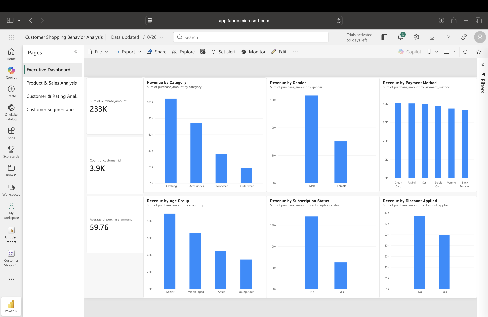
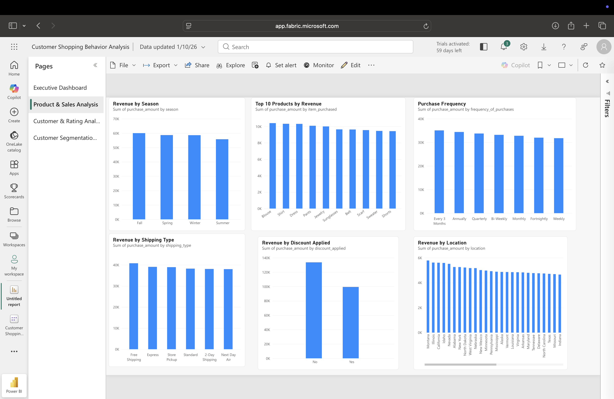
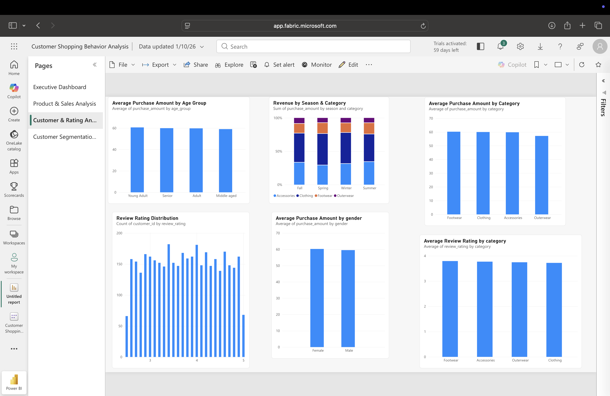
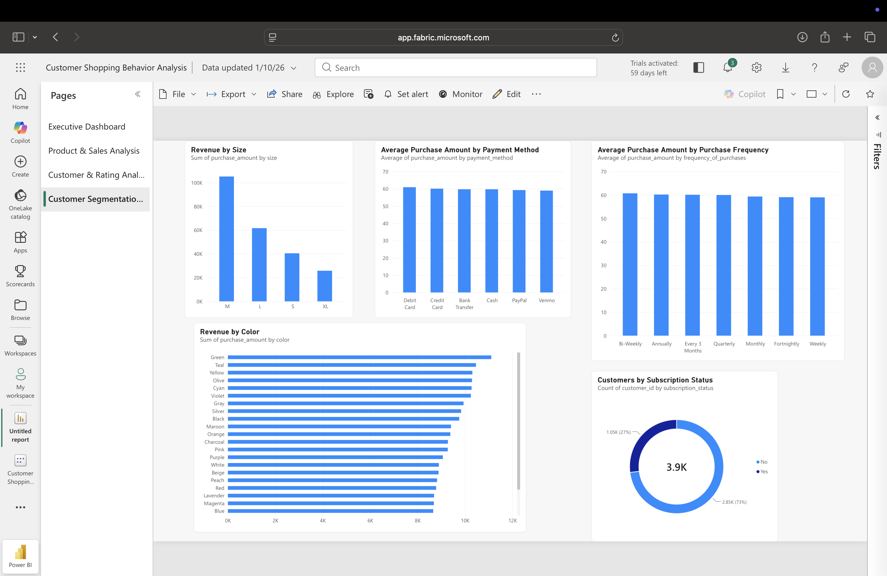

# 🛍️ Customer Shopping Behavior Analysis

An end-to-end data analytics project analyzing customer shopping behavior using **Python, PostgreSQL, SQL, and Microsoft Power BI/Fabric**.

The project covers the complete data analytics workflow:

**Data Cleaning → Exploratory Data Analysis → SQL Analysis → Power BI Dashboard → Business Insights**

---

## 📌 Project Overview

This project analyzes customer shopping data to understand purchasing patterns, customer segments, product performance, payment preferences, subscription behavior, discount usage, shipping methods, purchase frequency, and customer ratings.

The project demonstrates how raw customer transaction data can be transformed into meaningful business insights using Python, SQL, PostgreSQL, and Power BI/Fabric.

---

## 🎯 Objectives

- Analyze overall customer purchasing behavior
- Identify high-performing product categories and products
- Understand customer demographics and age groups
- Analyze subscription and discount behavior
- Compare payment and shipping methods
- Study purchase frequency and customer loyalty
- Analyze customer review ratings
- Analyze seasonal purchasing patterns
- Build an interactive business dashboard
- Generate meaningful business insights from customer data

---

## 📊 Dataset

The dataset contains **3,900 customer purchase records** with **19 cleaned attributes**.

### Main Features

- Customer ID
- Age
- Gender
- Item Purchased
- Category
- Purchase Amount
- Location
- Size
- Color
- Season
- Review Rating
- Subscription Status
- Shipping Type
- Discount Applied
- Previous Purchases
- Payment Method
- Frequency of Purchases
- Age Group
- Purchase Frequency Days

### Dataset Summary

| Metric | Value |
|---|---:|
| Total Records | 3,900 |
| Total Revenue | $233,081 |
| Average Purchase Amount | $59.76 |
| Average Review Rating | ~3.75 |
| Product Categories | 4 |
| Products | 25 |
| Locations | 50 |

---

## 🧹 Data Cleaning & Preparation

Data cleaning and feature engineering were performed using **Python and Pandas**.

The main steps included:

- Checking dataset shape and structure
- Checking data types
- Handling missing review ratings using category-level median values
- Standardizing column names
- Renaming columns for easier analysis
- Removing the redundant `promo_code_used` column
- Checking for duplicate records
- Creating customer age groups
- Converting purchase frequency into approximate days
- Validating missing values
- Exporting the final cleaned dataset

The final dataset contains **3,900 rows and 19 columns with no missing values**.

### Feature Engineering

#### Age Groups

Customers were grouped into:

- Young Adult
- Adult
- Middle-aged
- Senior

#### Purchase Frequency in Days

Purchase frequency was converted into approximate days:

| Frequency | Approx. Days |
|---|---:|
| Weekly | 7 |
| Bi-Weekly | 14 |
| Fortnightly | 14 |
| Monthly | 30 |
| Every 3 Months | 90 |
| Quarterly | 90 |
| Annually | 365 |

---

## 🐍 Python Analysis

Python was used for data cleaning, exploratory data analysis, aggregation, and visualization.

### Libraries Used

- Pandas
- NumPy
- Matplotlib
- Seaborn
- Jupyter Notebook

### Analysis Performed

- Revenue by category
- Revenue by gender
- Revenue by age group
- Revenue by subscription status
- Revenue by payment method
- Revenue by discount usage
- Revenue by season
- Revenue by shipping type
- Top 10 products by revenue
- Purchase frequency analysis
- Review rating distribution
- Customer loyalty analysis
- Category and season analysis

---

## 🗄️ SQL Analysis

The cleaned dataset was imported into **PostgreSQL** for structured business analysis.

### SQL Analysis Included

- Overall revenue and customer KPIs
- Category performance
- Gender-based purchasing behavior
- Subscription analysis
- Age group analysis
- Payment method analysis
- Shipping method analysis
- Discount analysis
- Product performance
- Seasonal analysis
- Purchase frequency analysis
- Review rating analysis
- Customer loyalty analysis
- Category and season analysis

---

## 📈 Power BI Dashboard

An interactive **Microsoft Power BI / Fabric dashboard** was created with four analytical pages.

### 1. Executive Dashboard

Provides an overview of:

- Total Revenue
- Total Customers
- Average Purchase Amount
- Revenue by Category
- Revenue by Gender
- Revenue by Payment Method
- Revenue by Age Group
- Revenue by Subscription Status
- Revenue by Discount Applied

### 2. Product & Sales Analysis

Includes:

- Revenue by Season
- Top 10 Products by Revenue
- Purchase Frequency
- Revenue by Shipping Type
- Revenue by Discount Applied
- Revenue by Location

### 3. Customer & Rating Analysis

Includes:

- Average Purchase Amount by Age Group
- Revenue by Season & Category
- Average Purchase Amount by Category
- Review Rating Distribution
- Average Purchase Amount by Gender
- Average Review Rating by Category

### 4. Customer Segmentation & Payment Analysis

Includes:

- Revenue by Size
- Average Purchase Amount by Payment Method
- Average Purchase Amount by Purchase Frequency
- Revenue by Color
- Customers by Subscription Status

---

## 📸 Dashboard Screenshots

### Executive Dashboard



### Product & Sales Analysis



### Customer & Rating Analysis



### Customer Segmentation & Payment Analysis



---

## 🔍 Key Findings

- Clothing generates the largest share of revenue among the four product categories.
- Male customers account for a larger share of the recorded purchases in this dataset.
- Both subscribed and non-subscribed customers are represented, allowing comparison of their purchasing behavior.
- Average purchase amounts are relatively consistent across major customer segments.
- Payment methods show relatively similar average purchase amounts.
- Discounted and non-discounted purchases can be compared to understand purchasing patterns.
- Product-level analysis identifies the products generating the highest revenue.
- Customer ratings are concentrated around the middle-to-high rating range.
- Purchase frequency categories show relatively similar average purchase amounts.
- Revenue varies across seasons, product categories, shipping methods, and customer segments.

These findings describe patterns observed in the dataset and do not establish causal relationships.

---

## 🛠️ Technologies Used

| Technology | Purpose |
|---|---|
| Python | Data cleaning and EDA |
| Pandas | Data manipulation |
| NumPy | Numerical analysis |
| Matplotlib | Data visualization |
| Seaborn | Data visualization |
| PostgreSQL | Database management |
| SQL | Business analysis |
| Microsoft Power BI / Fabric | Interactive dashboard |
| Git | Version control |
| GitHub | Project repository |
| VS Code | Development environment |
| Jupyter Notebook | Python analysis |

---

## 📁 Project Structure

```text
customer-shopping-analysis/
│
├── data/
│   └── customer_shopping_behavior_cleaned.csv
│
├── python/
│   └── customer_analysis.ipynb
│
├── sql/
│   └── customer_analysis.sql
│
├── screenshots/
│   ├── executive_dashboard.png
│   ├── product_sales_analysis.png
│   ├── customer_rating_analysis.png
│   └── customer_segmentation_payment.png
│
├── .gitignore
└── README.md
